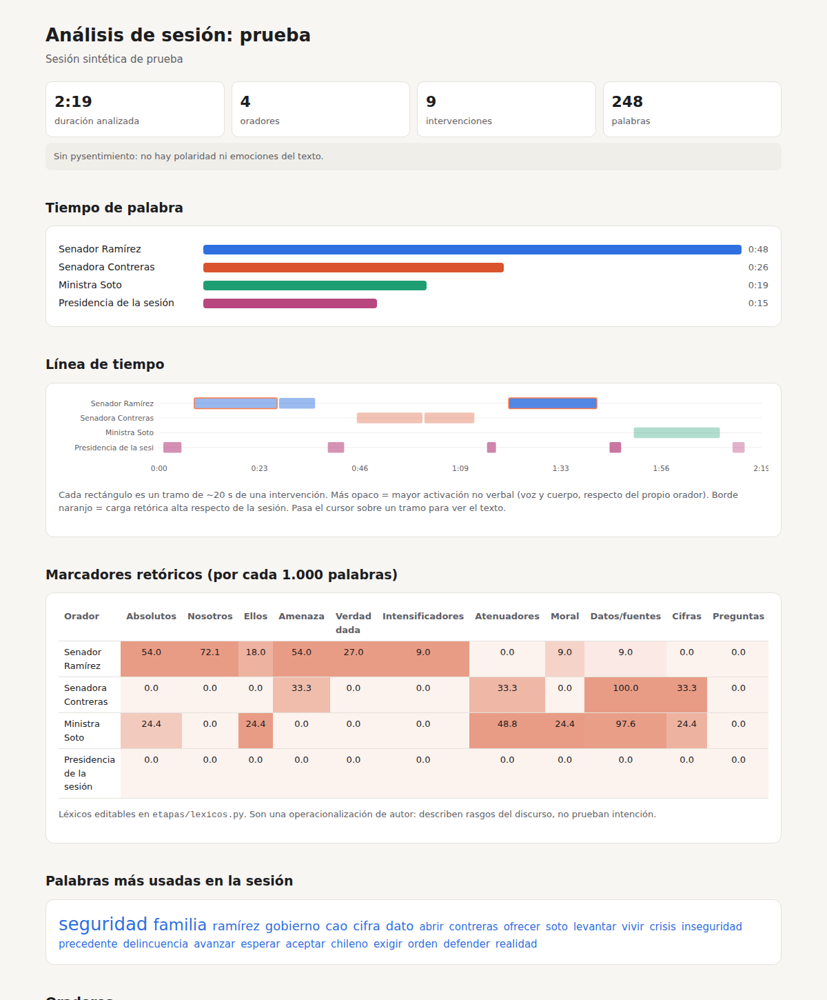

# Análisis verbal y no verbal de sesiones


Pipeline en Python que toma la grabación de una sesión (Senado TV, YouTube o un
video local) y entrega:

- **Transcripción por orador**, con nombre y marcas de tiempo.
- **Análisis verbal**: tiempo de palabra, palabras más repetidas, palabras
  distintivas de cada orador (keyness), frases que cada uno repite
  ("consignas"), marcadores retóricos (absolutos, nosotros/ellos, amenaza,
  verdad dada, atenuadores, datos, etc.) y sentimiento/emoción del texto.
- **Análisis no verbal**:
  - rostro: 52 blendshapes de MediaPipe resumidos en índices legibles
    (tensión del ceño, cejas elevadas, presión de labios, sonrisa, desagrado),
    más orientación y movimiento de la cabeza;
  - cuerpo: energía gestual de las manos;
  - voz: tono, variación de tono, volumen, velocidad y pausas.
- **Línea de tiempo** en tramos de ~20 s (CSV para Excel o pandas).
- **Reporte HTML** que se abre con doble clic.

La exportación a imágenes generativas todavía no está incluida: esta versión
llega hasta los datos (`linea_tiempo.csv` / `.json`), que después se pueden
conectar a ComfyUI o a MQTT.



En [`docs/ejemplo/`](docs/ejemplo/) hay un reporte, una línea de tiempo y una
tabla de oradores generados con una sesión sintética de prueba.

---

## 1. Instalación en Windows (una sola vez)

```powershell
git clone https://github.com/OWNER/REPO.git
cd REPO

# ffmpeg (para extraer audio y video)
winget install Gyan.FFmpeg
# cierra y vuelve a abrir PowerShell después de instalarlo

# entorno virtual de Python (3.10, 3.11 o 3.12)
py -3.11 -m venv .venv
.\.venv\Scripts\Activate.ps1

pip install -r requirements.txt
python -m spacy download es_core_news_md
```

Si PowerShell no deja activar el entorno, ejecuta una vez:
`Set-ExecutionPolicy -Scope CurrentUser RemoteSigned`.

**Si tienes GPU NVIDIA**, instala PyTorch con CUDA *antes* de
`requirements.txt` (ver https://pytorch.org/get-started/locally/) y en
`config.py` cambia `WHISPER_MODELO = "large-v3"`. Sin GPU todo funciona igual,
pero más lento: ver la sección de tiempos más abajo.

En **macOS o Linux** es lo mismo, cambiando `py -3.11 -m venv .venv` por
`python3 -m venv .venv`, la activación por `source .venv/bin/activate` y
ffmpeg por `brew install ffmpeg` o `sudo apt install ffmpeg`.

### Token de Hugging Face (para separar quién habla)

La diarización usa `pyannote`, que pide aceptar sus condiciones de uso:

1. Crea una cuenta gratuita en https://huggingface.co
2. Acepta las condiciones en
   https://huggingface.co/pyannote/speaker-diarization-3.1 y en
   https://huggingface.co/pyannote/segmentation-3.0
3. Crea un token de lectura en https://huggingface.co/settings/tokens
4. Copia `.env.example` como `.env` y pega ahí tu token:
   ```powershell
   copy .env.example .env
   notepad .env
   ```
   El `.env` está en `.gitignore`: el token nunca se sube al repositorio.
   También se puede pasar con `--hf-token hf_xxx` o con la variable de entorno
   `HF_TOKEN`.

Sin token el pipeline igual corre, pero todos los turnos quedan como un solo
hablante.

---

## 2. Uso

### Probar primero con un tramo corto (recomendado)

```powershell
python pipeline.py --sesion prueba --fuente "https://www.youtube.com/watch?v=XXXX" --desde 0:20:00 --hasta 0:30:00
```

### Sesión completa

```powershell
python pipeline.py --sesion senado_2026_09_23 --fuente "https://www.youtube.com/watch?v=XXXX"
```

También sirve un archivo local: `--fuente "C:\ruta\sesion.mp4"`.

### Corregir los nombres y recalcular

La diarización entrega hablantes anónimos (`SPEAKER_00`, ...). La etapa
`oradores` propone nombres a partir de frases como *"Tiene la palabra el senador
X"*, y los deja en `sesiones/<sesion>/oradores.csv`.

1. Abre `oradores.csv` en Excel.
2. Revisa `nombre_sugerido` junto con `muestra_texto` y `evidencia`.
3. Escribe o corrige la columna **`nombre`**. Si pones el mismo nombre a dos
   ids, se funden en un solo orador (pasa cuando pyannote divide a una persona
   en dos).
4. Recalcula solo el análisis, sin volver a transcribir:

```powershell
python pipeline.py --sesion senado_2026_09_23 --desde-etapa verbal
```

### Otras opciones

| Opción | Para qué |
|---|---|
| `--hablantes 12` | fija la cantidad de hablantes, si la conoces (mejora la diarización) |
| `--modelo-whisper small` | modelo más rápido (menos preciso) |
| `--sin-video` | omite rostro y cuerpo |
| `--sin-sentimiento` | omite pysentimiento |
| `--etapas verbal,reporte` | ejecuta solo esas etapas |
| `--recalcular-video` | vuelve a analizar el video aunque ya exista el CSV de cuadros |

Cada etapa guarda su resultado en `sesiones/<sesion>/`, así que se puede
volver a correr cualquier parte sin repetir las anteriores. Para recalcular la
diarización, borra `diarizacion.json`.

---

## 3. Qué produce

| Archivo | Contenido |
|---|---|
| `reporte.html` | reporte visual completo |
| `linea_tiempo.csv` | una fila por tramo de ~20 s con todas las métricas (para Excel/pandas) |
| `linea_tiempo.json` | lo mismo, con el texto y los marcadores anidados |
| `oradores.csv` | tabla de hablantes para asignar nombres |
| `verbal.json` | análisis verbal por orador y por tramo |
| `no_verbal.json` / `no_verbal_cuadros.csv` | rostro y cuerpo, resumido y cuadro a cuadro |
| `prosodia.json` | voz por tramo |
| `transcripcion.json`, `turnos.json`, `diarizacion.json` | pasos intermedios |

### Índices compuestos de la línea de tiempo (exploratorios)

- **carga_retorica**: marcadores de énfasis y polarización (absolutos, amenaza,
  intensificadores, verdad dada, "ellos") por cada 100 palabras.
- **activacion_vocal**: tono, volumen y variación de tono, comparados con la
  voz habitual del mismo orador (puntaje z).
- **activacion_corporal**: energía gestual, movimiento de cabeza y tensión del
  ceño respecto del mismo orador. Solo se calcula en tramos donde el rostro en
  pantalla parece ser el de quien habla.
- **desfase_verbal_no_verbal**: carga retórica (z) menos activación no verbal.
  - Positivo: el texto enfatiza más de lo que muestran el cuerpo y la voz.
  - Negativo: cuerpo y voz más activados que el texto.

Son propuestas de lectura, no mediciones validadas. Los léxicos están en
`etapas/lexicos.py` y los umbrales en `config.py`, para ajustarlos y
declararlos como decisión metodológica.

---

## 4. Tiempos aproximados (sesión de 1 hora)

| Etapa | Sin GPU | Con GPU NVIDIA |
|---|---|---|
| Transcripción (`medium`) | 40–90 min | 3–6 min |
| Diarización | 30–60 min | 2–4 min |
| Video (5 fps) | 15–30 min | 15–30 min (MediaPipe usa CPU) |
| Resto | < 2 min | < 2 min |

Para bajar los tiempos sin GPU: `--modelo-whisper small`, bajar
`VIDEO_FPS_ANALISIS` a 3 en `config.py`, o procesar por tramos con
`--desde/--hasta`.

---

## 5. Limitaciones conocidas

- **Planos de TV.** El rostro en pantalla no siempre es el de quien habla
  (planos de reacción, plano general). Cada tramo trae `frac_con_rostro` y
  `rostro_parece_hablar` (si la boca visible se mueve) para filtrar. El perfil
  no verbal de cada orador usa solo los tramos confiables.
- **Rostro no es emoción.** Los blendshapes describen movimientos musculares
  observables. Inferir emociones a partir de la cara es un tema científicamente
  discutido (Barrett et al., 2019).
- **Transcripción.** Whisper se equivoca más con nombres propios y cuando hablan
  varias personas a la vez. Para citar, contrasta con la versión taquigráfica
  oficial del Senado.
- **Diarización.** pyannote a veces divide a una persona en dos ids o junta a dos
  voces parecidas. Se corrige en `oradores.csv`.
- **Datos personales.** Aunque las sesiones son públicas, se procesan datos
  biométricos (rostro y voz) de personas identificables. Revisa el marco de la
  Ley 21.719 y los criterios éticos del programa antes de publicar resultados.

---

## Pruebas

Las pruebas usan una sesión sintética (voces de tonos armónicos y datos de
rostro simulados). No necesitan GPU ni descargar Whisper, pyannote o MediaPipe,
y corren en GitHub Actions en cada push.

```powershell
pip install -r requirements-dev.txt
python -m spacy download es_core_news_md
pytest -q
```

Para ver el reporte de la sesión sintética:

```powershell
python tests/sintetico.py
python pipeline.py --sesion sintetica --desde-etapa diarizacion --sin-sentimiento
```

---

## Estructura

```
.
├── pipeline.py          ← punto de entrada
├── config.py            ← todos los parámetros
├── requirements.txt     ← dependencias completas
├── requirements-dev.txt ← dependencias mínimas para las pruebas
├── .env.example         ← plantilla para el token de Hugging Face
├── docs/ejemplo/        ← reporte de ejemplo (sesión sintética)
├── tests/               ← sesión sintética + pytest
├── .github/workflows/   ← pruebas automáticas en GitHub Actions
└── etapas/
    ├── ingesta.py       descarga y extracción de audio/video
    ├── transcripcion.py faster-whisper con marcas por palabra
    ├── diarizacion.py   pyannote + turnos + ventanas de ~20 s
    ├── oradores.py      sugerencia de nombres → oradores.csv
    ├── verbal.py        frecuencias, keyness, consignas, marcadores, sentimiento
    ├── lexicos.py       léxicos de marcadores retóricos (editables)
    ├── no_verbal.py     MediaPipe rostro + pose
    ├── prosodia.py      voz con Praat (parselmouth)
    ├── linea_tiempo.py  fusión y puntajes z
    ├── reporte.py       reporte HTML
    └── util.py
```

---

Licencia MIT. Registro del uso de IA en [`AI_USAGE.md`](AI_USAGE.md).
