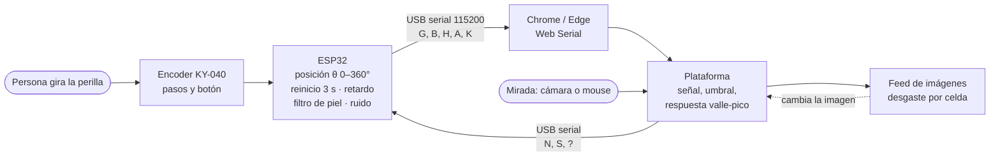
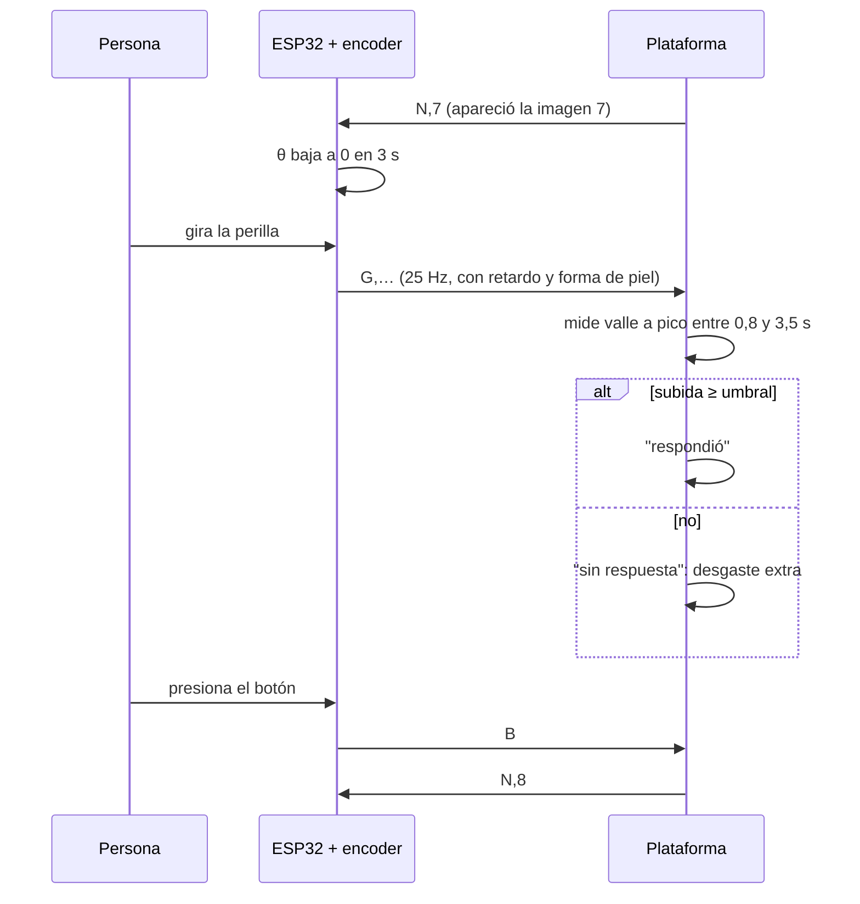

# Simulación de la respuesta galvánica de la piel con ESP32 y encoder

Estado: **implementado** en `lo_que_queda_esp32/lo_que_queda_esp32.ino` y en `index.html`. El código del ESP32 no se compiló en esta máquina y no se probó con el hardware. Describe cómo se comporta la piel real, cómo la imita la perilla, qué debe cambiar en la plataforma y en el dispositivo, y cómo fluye la información.

## 1. Cómo responde la piel de verdad

La conductancia de la piel (GSR o EDA) tiene dos componentes:

| Componente | Qué es | Valores típicos |
|---|---|---|
| **Tónico (SCL)** | Nivel de base, muy lento | 2 a 20 µS en la palma; deriva de décimas de µS por minuto |
| **Fásico (SCR)** | Pico que sigue a un estímulo | Amplitud desde 0,01–0,05 µS (umbral habitual) hasta varios µS |

Forma de una respuesta (SCR) ante un estímulo:

```
conductancia
   ^            pico (2–5 s tras el estímulo)
   |              /\
   |             /  \___
   |            /       \____         recuperación lenta
   |  _________/             \________ (mitad en 2–10 s)
   | latencia 1–3 s
   +-------------------------------------------> tiempo
     ^ estímulo
```

Cinco propiedades que importan para imitarla:

1. **Latencia de 1 a 3 s.** Nada ocurre en el instante del estímulo. La plataforma ya mide en una ventana de 0,8 a 3,5 s, coherente con esto.
2. **Subida rápida, bajada lenta.** Sube en 1 a 3 s y se recupera en 5 a 20 s. La respuesta es asimétrica y no un triángulo.
3. **Nunca vuelve a cero.** El cuerpo regresa a su nivel tónico, que no se reinicia. El «volver a 0» de la perilla es una convención del prototipo, no fisiología; conviene declararlo en la tesis.
4. **Las respuestas se suman y se saturan.** Dos estímulos seguidos se apilan, pero hay un techo.
5. **Hay habituación y ruido.** Ante estímulos repetidos la respuesta baja, y en reposo aparecen 1 a 3 picos espontáneos por minuto. El ruido electrónico es mínimo frente a esto.

Nota sobre el sensor real: el Grove GSR entrega un valor que sube cuando sube la **resistencia**. Es decir, baja cuando la piel conduce más. Por eso la plataforma tiene la opción «Invertir señal».

## 2. Cómo se traduce a la perilla

Se usa el encoder como **intensidad del estímulo** (cuánta activación quiere simular quien opera) y el ESP32 la convierte en una señal con forma de piel. La cadena es:

```
giro de la perilla → posición θ (0–360°) → rampa de reinicio → retardo → filtro asimétrico → + base y ruido → G (0–1023)
```

| Etapa | Qué hace | Valor propuesto (ajustable) |
|---|---|---|
| Posición θ | Cuenta los pasos del encoder; **se detiene en 0° y en 360°** (satura, no da la vuelta) | 20 pasos por vuelta ≈ 18° cada uno |
| Rampa de reinicio | Al cambiar de imagen, θ baja a 0 en 3 s | Exponencial con τ ≈ 0,75 s, y a los 3 s se fija en 0 |
| Retardo | Imita la latencia fisiológica | 1,0 s |
| Filtro asimétrico | Sube rápido y baja lento, como una SCR | Subida τ ≈ 0,7 s · bajada τ ≈ 2,5 s |
| Base y ruido | Nivel tónico fijo y ruido pequeño | Base 0,15 · ruido ±0,002 · deriva 0,0005/s |
| Salida | Se escala a 0–1023 para que la plataforma no cambie | 25 Hz |

Por qué un reinicio **exponencial** y no lineal: la recuperación fisiológica es exponencial y sin esquinas. Lineal en 3 s también se puede, pero se nota artificial.

Si vuelves a girar mientras θ está bajando, **los giros nuevos se suman** a lo que queda. Así la perilla sigue siendo útil durante esos 3 s.

Un solo paso (18°, 0,05 del rango) supera el umbral mínimo actual de 0,04, así que un clic cuenta como respuesta. Si quieres que haga falta girar más, se baja la ganancia por paso o se sube «Amplitud mínima» en 04 · Parámetros.

## 3. Cambios en la plataforma (`index.html`)

1. **Escribir al ESP32.** Hoy la página solo lee el puerto. Hay que guardar el puerto y un escritor, para enviar texto.
2. **Avisar el cambio de imagen.** En `next()`, enviar `N,<n>` cada vez que aparece una imagen, incluida la primera. Al iniciar la calibración de la piel enviar `S,1`, y al cerrar la sesión `S,0`.
3. **Quitar el avance por perilla.** Hoy `E,1` avanza el feed. Con la perilla como estímulo ya no puede hacerlo: el ESP32 no envía más `E`. El feed avanza con el **botón del encoder** (`B` pasa a llamar `next()` durante el feed), con clic, barra espaciadora, rueda o el modo automático.
4. **Cambiar cómo se mide la respuesta.** `amplitudeAt` calcula «máximo de la ventana − mínimo previo». Con el reinicio bajando durante la ventana, esa medida se descompone. Debe pasar a **valle a pico**: la mayor subida sobre el mínimo corriente que aparece en la ventana. Una caída monótona no genera subida, y un giro nuevo sí.
5. **Abrir el puerto sin reiniciar la placa.** Al abrir el puerto, muchas placas ESP32 se reinician. Después de `port.open` hay que fijar `setSignals({dataTerminalReady: false, requestToSend: false})`, y la página debe tolerar las líneas de arranque del ESP32.
6. **Saludo y estado.** Aceptar `H,...` del dispositivo para mostrar «ESP32 conectado» y su versión, y avisar si no llega señal.
7. **Parámetros.** Quitar «Pasos de perilla por imagen», que ya no aplica. Ajustar los valores por defecto de la ventana de respuesta si hace falta tras probar.

## 4. Cambios en el dispositivo (`.ino` para ESP32)

1. Pines propuestos: CLK = GPIO 32, DT = GPIO 33, SW = GPIO 25. Alimentar el KY-040 con **3,3 V**, no 5 V.
2. Decodificar el encoder con interrupciones o con el contador de pulsos por hardware del ESP32, para no perder pasos.
3. Mantener la posición θ y aplicar las etapas de la sección 2 a 25 Hz.
4. Leer comandos por serial: `N,<n>` inicia la rampa de reinicio; `S,1` deja θ en 0 y la señal en reposo; `S,0` también y la deja en reposo; `?` pide el saludo.
5. Escribir por serial: `G,<0–1023>` a 25 Hz, `B` al presionar el botón, `H,esp32-gsr,1` al arrancar y ante `?`, y `A,<n>` como acuse de `N`. Opcionalmente `K,<grados>` para mostrar la posición de la perilla en el panel.
6. Convertir la salida a 0–1023: el ESP32 trabaja a 12 bits (0–4095), pero la plataforma divide por 1023.
7. Velocidad de 115200 baudios, igual que hoy.

## 5. Protocolo serial (una línea por mensaje, 115200 baudios)

| Dirección | Mensaje | Significado |
|---|---|---|
| ESP32 → página | `G,512` | Señal simulada de la piel, 25 veces por segundo |
| ESP32 → página | `B` | Botón presionado |
| ESP32 → página | `H,esp32-gsr,1` | Saludo y versión |
| ESP32 → página | `A,7` | Recibí «imagen 7» |
| ESP32 → página | `K,126` | (opcional) Posición de la perilla en grados |
| Página → ESP32 | `N,7` | Cambió la imagen; es la imagen número 7 |
| Página → ESP32 | `S,1` / `S,0` | Comienza / termina la sesión |
| Página → ESP32 | `?` | ¿Quién eres? |

Desaparece `E,1` / `E,-1`.

## 6. Flujo de información



Secuencia de una imagen:



## 7. Cómo funciona todo, en palabras

Quien opera la perilla hace de «cuerpo»: gira cuando quiere simular que la piel reacciona a la imagen. El ESP32 no manda la posición cruda de la perilla: la convierte en una señal con la forma de una conductancia real, con retardo, subida rápida, bajada lenta y un poco de ruido. La plataforma la recibe por USB como si viniera del sensor GSR y no necesita saber que es una simulación.

Cada vez que aparece una imagen, la plataforma se lo dice al ESP32. Este deja caer la «activación» acumulada hasta cero en 3 segundos, de forma gradual, para que cada imagen parta de un estímulo limpio. Mientras tanto la persona puede volver a girar, y esos giros se suman a lo que queda.

La plataforma mira entre 0,8 y 3,5 segundos después de que aparece la imagen. Si la señal sube más que el umbral personal, calculado en la calibración de 20 segundos de reposo, cuenta como respuesta. Si no, esa imagen se gasta más rápido en las zonas que se miraron. Con varias imágenes seguidas sin respuesta, el feed se cierra y aparece el informe.

El botón de la perilla pasa a la siguiente imagen. Se debe registrar en la tesis que el protocolo es un «Mago de Oz» (una persona simula la respuesta) y que el reinicio a cero no es fisiológico.

## 8. Decisiones abiertas

Resueltas: placa ESP32 DevKit, encoder KY-040 de 20 pasos por vuelta, el botón avanza el feed y el reinicio es exponencial.

Por ajustar con el hardware: `PASOS_POR_VUELTA` (algunos KY-040 dan 30 pulsos por vuelta), `INVERTIR_GIRO`, y la relación entre un paso de la perilla (0,045 del rango) y la «Amplitud mínima» de la plataforma (0,04).
